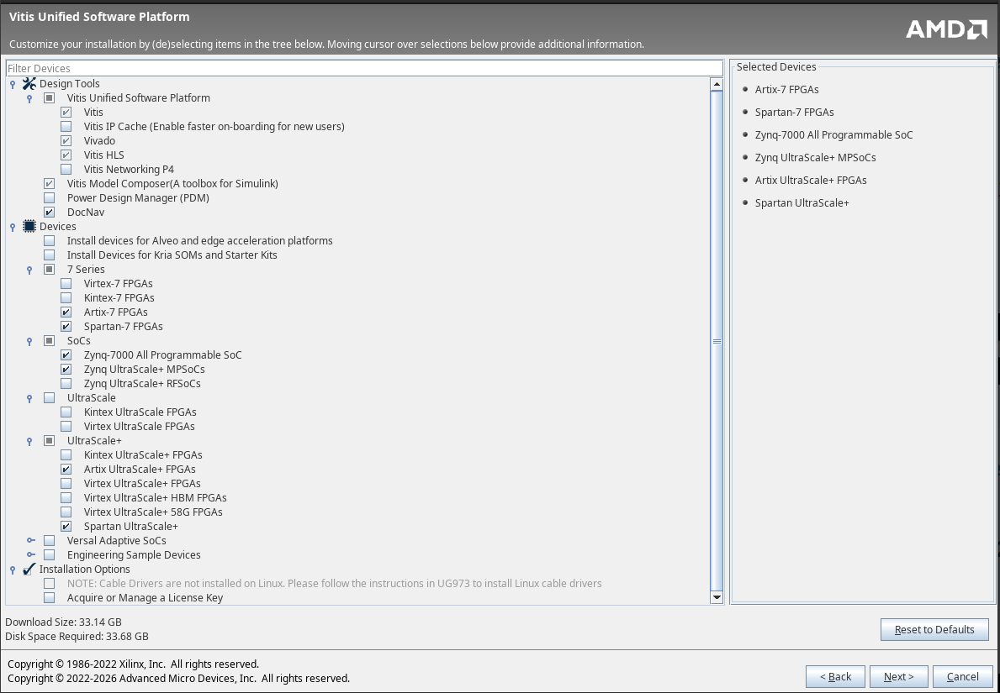

# dev-containers

Docker files needed for general development.

Versions are set in the .env file and loaded by the docker compose.

## rtl-sim

Verilog simulation libraries using [cocotb](https://www.cocotb.org/) and [Verilator](https://verilator.org/guide/latest/index.html)

- Posted on [DockerHub](https://hub.docker.com/repository/docker/tomkarolyshyn/rtl-sim/general)


## llvm-python

LLVM 20 and python3.12

- Posted on [DockerHub](https://hub.docker.com/repository/docker/tomkarolyshyn/llvm-python/general)

## llvm-verilator

llvm-python with verilator installed (same method as rtl-sim but different base image)

## llvm-oss
llvm-python base image with OSS-CAD-SUITE installed.

## llvm-cuda
CUDA image with LLVM and OSS installed (full dev build), for Ubuntu 24 LTS.

### Building CUDA containers
Be sure to follow the [instructions](https://docs.nvidia.com/datacenter/cloud-native/container-toolkit/latest/install-guide.html) from Nvidia on setup for both building and running.


## vitis image

The vitis image is currently based of the base Ubuntu image, but certainly modifiyable to your req's.  Also, you'll need to download the Vitis software first, before running the docker image installer.

### Vitis Installer download

- Following this [Install Ref](https://docs.amd.com/r/en-US/ug973-vivado-release-notes-install-license/Batch-Mode-Installation-Flow)

1. Download the [Linux web installer](https://www.xilinx.com/member/forms/download/xef.html?filename=FPGAs_AdaptiveSoCs_Unified_SDI_2025.2_1114_2157_Lin64.bin) from [Xilinx Downloads](https://www.xilinx.com/support/download.html)
    - you will need a valid login from AMD/Xilinx
    - you may have to do a chmod +x to make executable.
    - ⚠️ the installer does NOT do resolution scaling, so you may want to adjust from 4k before launching.
2. Run the tool setup tool :
    - Enter login information
    - Select "Download Image (Install Separately)"
    <!-- - Select "Selected Product Only" (to reduce size) -->
    - Enter desired save location (ie : /home/USERNAME/Downloads/vitis_2025.2)
    - ℹ️ Select "Full Image" for the download.
        - See [install_config.txt](./vitis/install_config.txt) for customization on the docker installation.
    - Click **Next>**
<!-- 3. Select **Vitis**, Click **Next>** -->
<!-- 4. Click **Next>** again (for **Vitis Unified Software Platform**) -->
<!-- 5. Select Desired components (example below selects 6️⃣ devices):
    - **7 Series**
        - Artix-7 FPGAs
        - Spartan-7 FPGAs
    - **SOCs**
        - Zynq-7000
        - Zynq Ultrascale+ MPSoC's
    - **Ultrascale+**
        - Artix Ultrascale+ FPGAs
        - Spartan Ultrascale+
    - Remove "Add or Manage a License Key"
    - Click **Next>**
-->
6. Final page, Click **Download** ... and wait
    - Quoted download size ~85GB.
7. Move the downloaded folder to dev-containers/vitis/vitis_2025.2
8. Update the [install_config.txt](./vitis/install_config.txt) to reflect required devices.
    - Defaults will work for current projects.
    - you can check this by running to install, and look for warnings.
    ```bash
    cd vitis/vitis_2025.2
    ./xsetup --agree 3rdPartyEULA,XilinxEULA --batch Install --location ${HOME}/Xilinx-test --config ../install_config.txt
    ```
    - It will print any warnings, and you can cancel once installation starts (if desired).
10.  Now you're ready to build the docker.
    - make vitis-build
    - ...wait
    - creates a 62GB docker image.

<!--  -->


ℹ️ : **Cannot upload the vitis image to docker hub due to size and license issues.**
